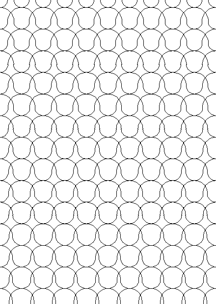
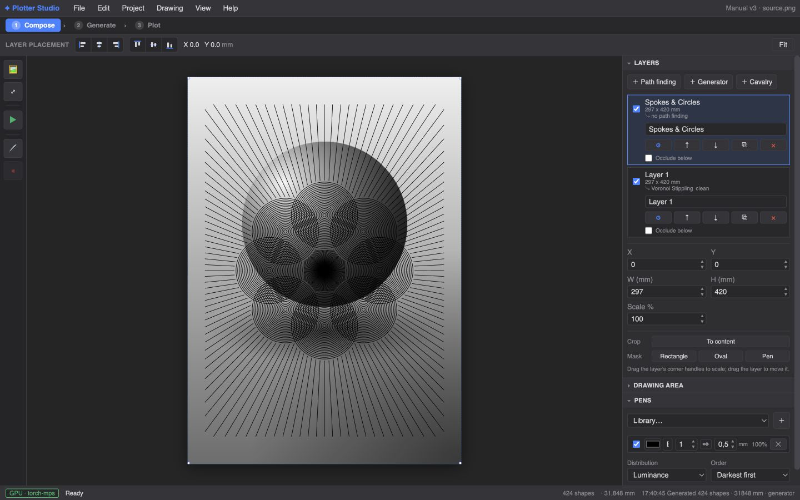
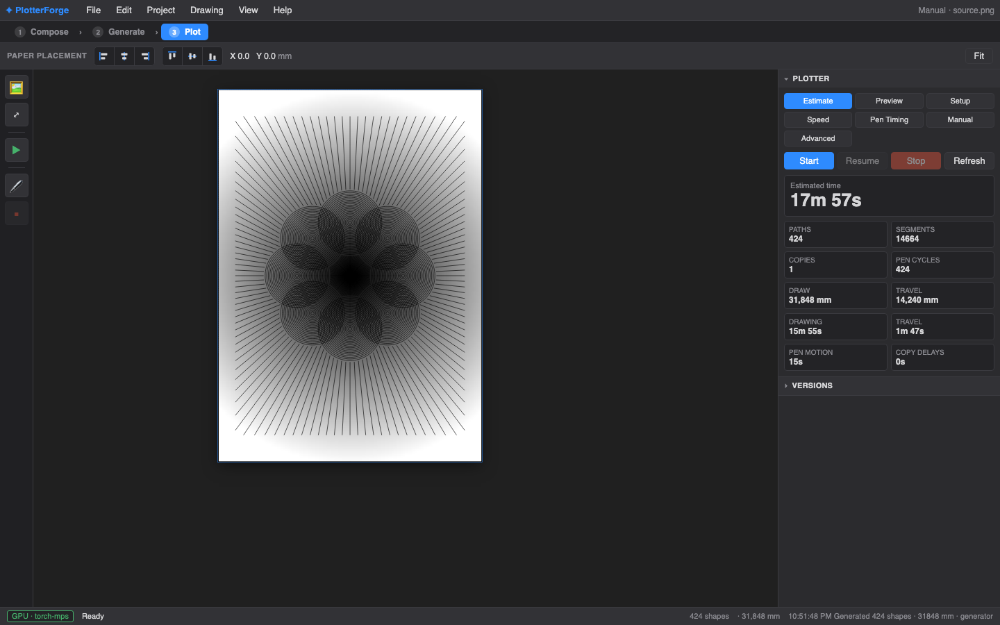

# PlotterForge

Turn a photo (or a procedural drawing) into layered, pen-plotter-ready SVG, then
preview it and plot it — all in one app.

PlotterForge is a browser-based studio for pen plotters, in the spirit of
DrawingBotV3. You import images as movable layers, pick a path-finding style
(stippling, hatching, TSP art, flow fields, tessellations, dithers, and more),
arrange everything on a real page with real pens, and either export an SVG or
drive a Grbl plotter directly.


## A note on how this was built

This project was vibe-coded — most of the code was written with an AI assistant
rather than typed by hand. That's the honest origin story, and you should factor
it into your expectations: the architecture is pragmatic, not academic, and
there are corners that reflect "what worked" over "what's textbook."

What it isn't, though, is untested. I use PlotterForge as my actual plotting
tool. Every style, the layer system, the pen sets, and the live Grbl plotting
have been run against real hardware and real drawings, repeatedly, because I
needed them to work for my own art. So: AI-written, human-hammered.

## What it does

- **50 path-finding styles.** Samplers (Voronoi, LBG, adaptive, Poisson-disk)
  combined with looks like stippling, dashes, shapes, triangulation, trees,
  diagrams, and TSP, plus grid halftone, spiral, hatch, sketch, streamlines,
  dither halftone, circle packing, differential growth, quadtree mosaic, and
  raster-driven tessellations. Each style's controls are generated from a typed
  schema, so nothing is hidden.
- **Layer-based composition.** Photos come in as non-destructive raster layers
  (EXIF-correct, never auto-cropped). Move, scale, rotate, fit, or fill them;
  the path-finding follows whatever transform you set.
- **Click-to-segment (SAM2).** Click a region of your source image and run a
  different style on it than on the rest.
- **Real page, real pens.** Set the drawing area in physical units, define a
  multi-pen set with per-pen width and colour, preview flat-nib calligraphy, and
  plot each pen as its own pass with guided pen changes.
- **Plot or export.** Live plot preview with a time estimate, direct Grbl serial
  plotting with a safe Stop/Resume, or a multi-layer millimetre SVG for Inkscape,
  vpype, or your plotter's own software.
- **Versioned projects.** Immutable snapshots with thumbnails, kept under
  `~/.plotterforge/`.
- **GPU when you have one.** PyTorch acceleration (CUDA on Windows, MPS on Apple
  Silicon) for the sampling-heavy styles, with a CPU fallback that just works.
- **Cavalry bridges.** Stream SVG frames live from Cavalry, or bake a Cavalry
  composition into a reusable tone-responsive tessellation style.

Full feature list: [FEATURES.md](FEATURES.md).

## Pick a style

Every style ships with a preview so you can eyeball the look before committing.
A few, to give you the range:

| | | |
|---|---|---|
|  |  |  |
| Voronoi stippling | Hatch | Streamlines |
|  |  |  |
| TSP art | Circle packing | Tessellation |

The full picker, with live previews, is built into the app:


## For non-programmers

You don't need to touch a terminal after the one-time setup, and you never need
Node or a build step — the app's interface is pre-built and committed.

1. Install the two prerequisites below (uv and Node.js — both have normal
   installers).
2. Run the setup script for your OS **once**.
3. Run the start script and open **http://localhost:7438** in your browser.

That's it. Everything after that happens in the browser: import a photo, choose a
style, arrange it on the page, hit plot or export. A full illustrated manual is
built into the app and opens from inside it.



## For programmers

- `engine/` — the conversion engine (styles, samplers, pens, drawing area,
  version control, GPU/CPU backends, SVG output). Pure Python, runs headless,
  fully testable.
- `frontend/` — a Svelte 5 single-page app. `npm run build` writes to
  `web/static/app`, which is committed so end users skip the JS toolchain.
- `web/server.py` — Flask API plus the plotter driver. Serves the SPA, runs the
  engine, streams plot progress, talks Grbl over serial.

Style controls are declared as typed schemas in `engine/params.py`, and the
manual's parameter reference is generated from them. See
[Development](#development).

## Install

### Requirements

- **Windows** 10/11 with an NVIDIA GPU and a current driver, **or** **macOS** on
  Apple Silicon
- [uv](https://docs.astral.sh/uv/) — the Python project manager (handles Python
  3.13 for you; no Conda)
- [Node.js](https://nodejs.org/) with npm

### One-time setup

| Platform | Run |
|---|---|
| Windows | `setup-windows.bat` |
| macOS | `./setup-macos.command` (or double-click in Finder) |

Setup installs the right PyTorch build for your machine, a pinned SAM2 and its
default checkpoint, and the frontend dependencies. It then runs a real
segmentation inference to confirm things actually work before saying "done".
Rerun it after pulling dependency or frontend changes.

## Launch

| Platform | Run |
|---|---|
| Windows | `start-windows.bat` |
| macOS | `./start-macos.command` (or double-click in Finder) |

Open **http://localhost:7438**. The launchers are offline and side-effect-free:
they never install, sync, build, download, or kill processes.

### If something goes wrong

- **`uv` or Node.js not found** — install it, then rerun the setup script.
- **"Run setup first"** — the `.venv` is missing or stale; rerun setup.
- **`Port 7438 is already in use by PID …`** — another instance is running. Stop
  that PID and relaunch (the launchers won't kill it for you).
- **CUDA/MPS unavailable** — check your GPU driver (Windows) or that you're on
  Apple Silicon (macOS), then rerun setup.
- **`setup is incomplete: missing …`** — SAM2, Torch, or the checkpoint is
  absent. Rerun setup; the server never installs anything at runtime.

The in-app [Troubleshooting](http://localhost:7438/static/docs/troubleshooting.html)
chapter covers first-plot calibration and the safe Stop/Resume procedure.

## Plot it

Preview the toolpath, check the time estimate, and either plot over serial or
export SVG.



## Documentation

The full manual ships with the app and is served locally while it runs.

| Guide | For |
|---|---|
| [Manual](http://localhost:7438/static/docs/index.html) | Start here — a tour of the whole workflow |
| [Tutorials](http://localhost:7438/static/docs/tutorials.html) | Three reproducible start-to-finish artworks |
| [Choose a style](http://localhost:7438/static/docs/choose-a-style.html) | Decision guide across all 50 styles |
| [Parameter reference](http://localhost:7438/static/docs/reference.html) | Every control, default, range, and description |
| [Pens, paper & plotting](http://localhost:7438/static/docs/plot.html) | Operators: calibration, pen changes, safety |
| [Cavalry tessellations](docs/cavalry-tessellations.md) | Bake Cavalry comps into custom styles |

## How it works

```
image / generator ──▶ engine (style) ──▶ Drawing ──▶ multi-layer mm SVG ──▶ plot / export
```

Projects, versions, models, and installed tessellations live under
`~/.plotterforge/` (migrated automatically from the older `~/.plotter_studio/`
if it's there).

## Development

```sh
# Backend tests
uv run --no-sync python -m pytest

# Frontend dev server with hot reload (proxies /api to Flask on :7438)
cd frontend && npm run dev

# Frontend build (regenerates web/static/app)
cd frontend && npm run build

# End-to-end tests (Playwright, isolated HOME + locked env)
cd frontend && npm run e2e

# Regenerate the manual's parameter reference after editing engine/params.py
uv run --no-sync python tools/build_docs_reference.py

# Check the manual for broken links and stale screenshots
uv run --no-sync python tools/check_docs.py
```

The deterministic CPU/MPS/CUDA/browser profiling suite is documented in
[docs/profiling.md](docs/profiling.md); CI publishes a performance profile on
every pull request. Product notes live in [docs/product-roadmap.md](docs/product-roadmap.md).

## Wireless plotting from Inkscape

Prefer to plot from Inkscape? The [bridge/](bridge/README.md) setup exposes a
plotter connected to a Raspberry Pi as a local virtual serial port over
Tailscale, so the UUNA TEK / iDraw extension works wirelessly. The bridge holds
the serial port while running, so stop it before plotting from PlotterForge.

## Project layout

```
engine/        Conversion engine: styles, samplers, pens, drawing area,
               version control, GPU/CPU backend, SVG output
frontend/      Svelte 5 SPA; `npm run build` → web/static/app
web/           Flask API + plotter driver
docs/          Developer docs: Cavalry guide, profiling, roadmap, design notes
tests/         Backend test suite (pytest)
tools/         Repo-local entry points (docs generator/checker)
profiling/     Deterministic performance profiling suite
bridge/        Wireless serial bridge: plot from Mac Inkscape via a Pi
cavalry/       Cavalry UI script for live capture + tessellation baking
legacy/        Original single-image desktop GUI (see legacy/README.md)
pyproject.toml uv manifest (engine + web deps; cuda/mps + sam2 extras)
uv.lock        locked dependency tree
```

## License

[MIT](LICENSE)
