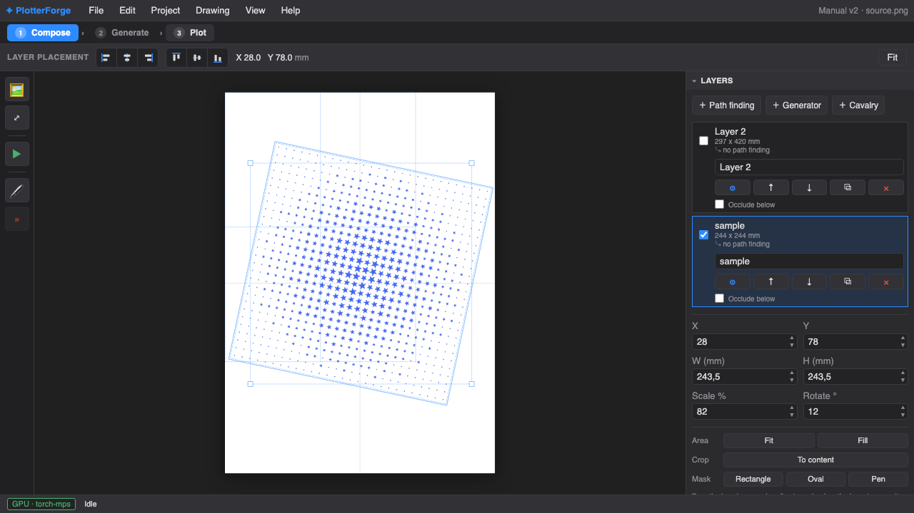

# PlotterForge

**Turn raster images and procedural drawings into layered, plotter-ready SVG — then preview and plot them, all in one app.**

PlotterForge is a DrawingBotV3-style studio for pen plotters. Import photos as
freely transformable layers, apply one of **50 built-in path-finding styles**
(stippling, hatching, TSP art, flow fields, tessellations, dithers, …), compose
the results on a physical page with a multi-pen drawing set, and export SVG or
drive a Grbl plotter directly — with GPU acceleration and AI-assisted region
segmentation (SAM2) built in.



## Highlights

- **50 Path Finding Modules** — Voronoi / LBG / Adaptive / Poisson-disk samplers
  × Stippling, Dashes, Shapes, Triangulation, Tree, Diagram, and TSP styles,
  plus Grid Halftone, Spiral, Hatch, Sketch, Streamlines, Composite, Dither
  Halftone, Shape Dither, Circle Packing, Differential Growth, Quadtree Mosaic,
  and raster-driven Tessellations. Every module's controls are auto-generated
  from a typed schema.
- **Layer-based composition** — images import as non-destructive raster layers
  (EXIF-correct, never cropped) that can be moved, scaled, rotated, fitted, or
  filled; path finding follows the layer's transform.
- **AI segmentation** — click-to-segment source images with SAM2 and run a
  different style per region.
- **Real page, real pens** — Drawing Area with physical units, multi-pen
  Drawing Sets with per-pen width and colour, flat-nib calligraphy preview,
  per-pen plot passes with guided pen changes.
- **Plot it** — live plot preview and time estimate, direct Grbl serial
  plotting with safe Stop/Resume, or multi-layer mm-unit SVG export for
  Inkscape / vpype / your plotter's own software.
- **Versioned projects** — immutable snapshots with thumbnails, stored under
  `~/.plotterforge/`.
- **GPU-first** — PyTorch acceleration (CUDA on Windows, MPS on macOS) for the
  heavy sampling stages, with a transparent CPU fallback.
- **Live bridges** — stream SVG frames from Cavalry, or bake Cavalry
  compositions into reusable tone-responsive tessellation styles.

The complete feature list lives in [FEATURES.md](FEATURES.md).

## Install

### Requirements

- **Windows** 10/11 with an NVIDIA GPU and a current driver, **or**
  **macOS** on MPS-capable (Apple Silicon) hardware
- [uv](https://docs.astral.sh/uv/) — Python project manager
- [Node.js](https://nodejs.org/) with npm

Python 3.13 is installed and managed by uv. Conda is not used.

### One-time setup

| Platform | Run |
|---|---|
| Windows | `setup-windows.bat` |
| macOS | `./setup-macos.command` (double-click in Finder works too) |

Setup installs the platform PyTorch build, pinned SAM2, the default checkpoint,
and frontend dependencies, then verifies a real segmentation inference before
reporting success. Rerun it after pulling dependency or frontend changes.

## Launch

| Platform | Run |
|---|---|
| Windows | `start-windows.bat` |
| macOS | `./start-macos.command` (double-click in Finder works too) |

Then open **http://localhost:7438**. The launchers are offline and
side-effect-free: they never install, sync, build, download, or kill processes.

### If something goes wrong

- **`uv` or Node.js not found** — install them, then rerun the platform setup script.
- **`Run setup-windows.bat first.` / `Run ./setup-macos.command first.`** — the
  `.venv` is missing or stale; rerun the platform setup script.
- **`Port 7438 is already in use by PID …`** — another instance is running;
  stop that PID and relaunch (launchers never kill the port owner).
- **CUDA/MPS unavailable** — check your GPU driver (Windows) or that you are on
  Apple Silicon (macOS), then rerun setup.
- **`PlotterForge setup is incomplete: missing …`** — SAM2, Torch, or the
  checkpoint is absent; rerun the platform setup script (the server never
  installs anything at runtime).

More in the in-app [Troubleshooting](http://localhost:7438/static/docs/troubleshooting.html)
chapter, including first-plot calibration and the safe Stop/Resume procedure.

## Documentation

A full manual ships with the app and is served locally while it runs.

- **For artists** — start with the flagship tutorials, then use *Choose a
  style* and the generated PFM reference.
- **For plotter operators** — read *Pens, paper & plotting* and
  *Troubleshooting*, including first-plot calibration and safe Stop/Resume.
- **For developers** — see [Development](#development), [docs/](docs/), and the
  typed engine schemas in `engine/params.py`.

| Guide | For |
|---|---|
| [Artist manual](http://localhost:7438/static/docs/index.html) | Start here — guided tour of the whole workflow |
| [Tutorials](http://localhost:7438/static/docs/tutorials.html) | Three reproducible start-to-finish artworks |
| [Choose a style](http://localhost:7438/static/docs/choose-a-style.html) | Decision guide across all 50 styles |
| [PFM reference](http://localhost:7438/static/docs/reference.html) | Every parameter, default, range, and description |
| [Pens, paper & plotting](http://localhost:7438/static/docs/plot.html) | Plotter operators: calibration, pen changes, safety |
| [Cavalry tessellations](docs/cavalry-tessellations.md) | Bake Cavalry comps into custom styles (in-app version: [/static/docs/tessellations.html](http://localhost:7438/static/docs/tessellations.html)) |

## How it works

```
image / generator ──▶ engine (PFM) ──▶ Drawing ──▶ multi-layer mm SVG ──▶ plot / export
```

- `engine/` — the conversion engine: PFMs, samplers, styles, pens, drawing
  area, version control, GPU/CPU backends, SVG output. Pure Python, fully
  testable headless.
- `frontend/` — a Svelte 5 single-page app (Photoshop-style UI). Built output
  is committed to `web/static/app`, so users never need a JS toolchain.
- `web/server.py` — Flask API + plotter driver: serves the SPA, runs the
  engine, streams plot progress, talks Grbl over serial.

Projects, versions, models, and installed tessellations live under
`~/.plotterforge/` (migrated automatically from the pre-rename
`~/.plotter_studio/` if present).

## Development

```sh
# Backend tests
uv run --no-sync python -m pytest

# Frontend dev server with hot reload (proxies /api to Flask on :7438)
cd frontend && npm run dev

# Frontend build (regenerates web/static/app)
cd frontend && npm run build

# End-to-end tests (Playwright, isolated HOME + locked env)
cd frontend && npm run e2e

# Regenerate the manual's PFM reference after changing engine/params.py
uv run --no-sync python tools/build_docs_reference.py

# Check the manual for broken links, stale screenshots, and drift
uv run --no-sync python tools/check_docs.py

# Retake the manual's screenshots from the live app (writes web/static/docs/img)
cd frontend && E2E_BACKEND_CMD="uv run --locked --no-sync python -m web.server" \
  DOCS_CAPTURE=1 npx playwright test docs-capture
```

The deterministic CPU/MPS/CUDA/browser profiling suite is documented in
[docs/profiling.md](docs/profiling.md); CI publishes a performance profile on
every pull request. Product direction notes live in
[docs/product-roadmap.md](docs/product-roadmap.md).

## Wireless plotting from Inkscape

Prefer plotting from Inkscape? The [bridge/](bridge/README.md) setup exposes a
plotter connected to a Raspberry Pi as a local virtual serial port over
Tailscale, so the UUNA TEK / iDraw extension works wirelessly. Note the bridge
holds the serial port while running — stop it to plot from PlotterForge.

## Project layout

```
engine/        Conversion engine: PFMs, samplers, styles, pens, drawing area,
               version control, GPU/CPU backend, SVG output
frontend/      Svelte 5 SPA; `npm run build` → web/static/app
web/           Flask API + plotter driver (serves the SPA, runs the engine, plots)
docs/          Developer docs: Cavalry guide, profiling, roadmap, design notes
tests/         Backend test suite (pytest)
tools/         Repo-local entry points (docs generator/checker, profiling suite)
profiling/     Deterministic performance profiling suite (see docs/profiling.md)
bridge/        Wireless serial bridge: plot from Mac Inkscape via a Pi
cavalry/       Cavalry UI script for live capture + tessellation baking
legacy/        Original single-image desktop GUI (see legacy/README.md)
pyproject.toml uv manifest (engine + web deps; `cuda`/`mps` + `sam2` extras)
uv.lock        locked dependency tree
```

## License

[MIT](LICENSE)
